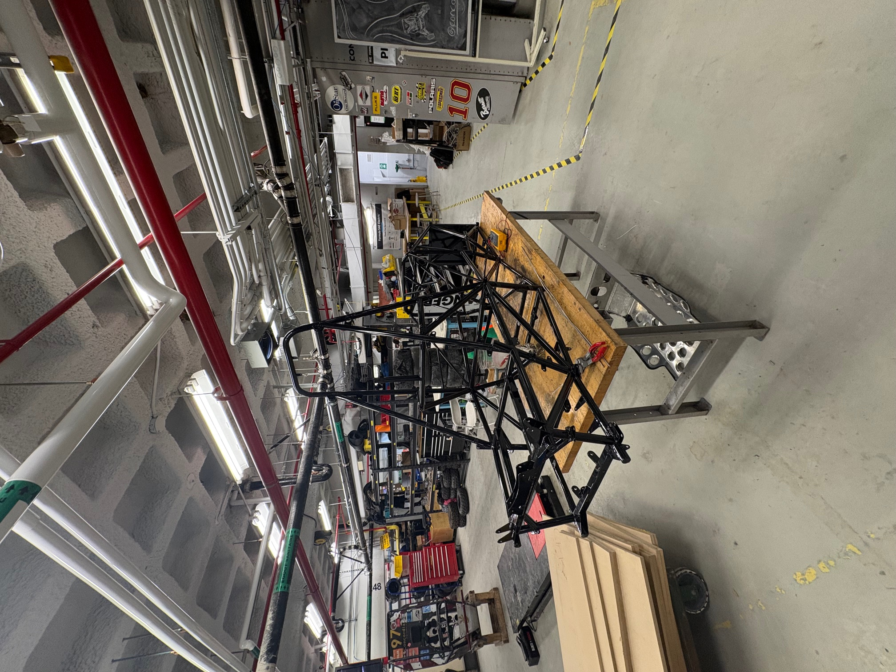
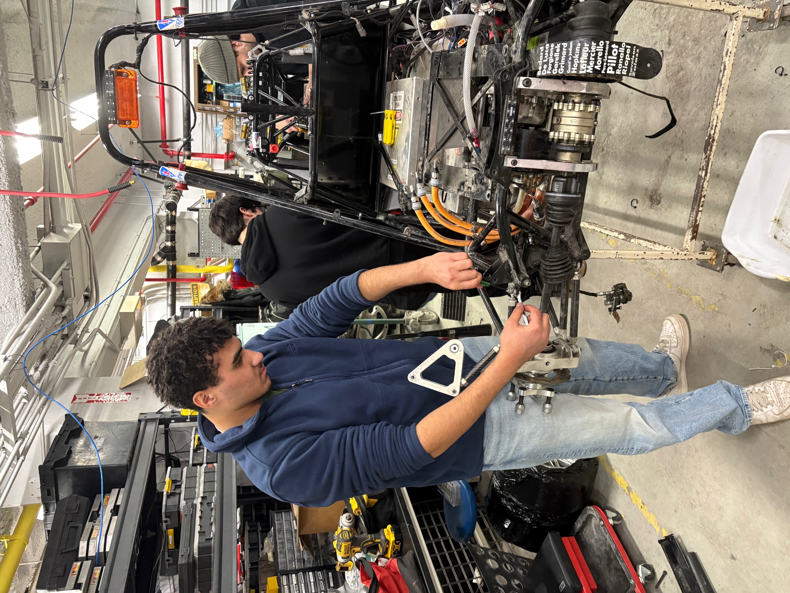
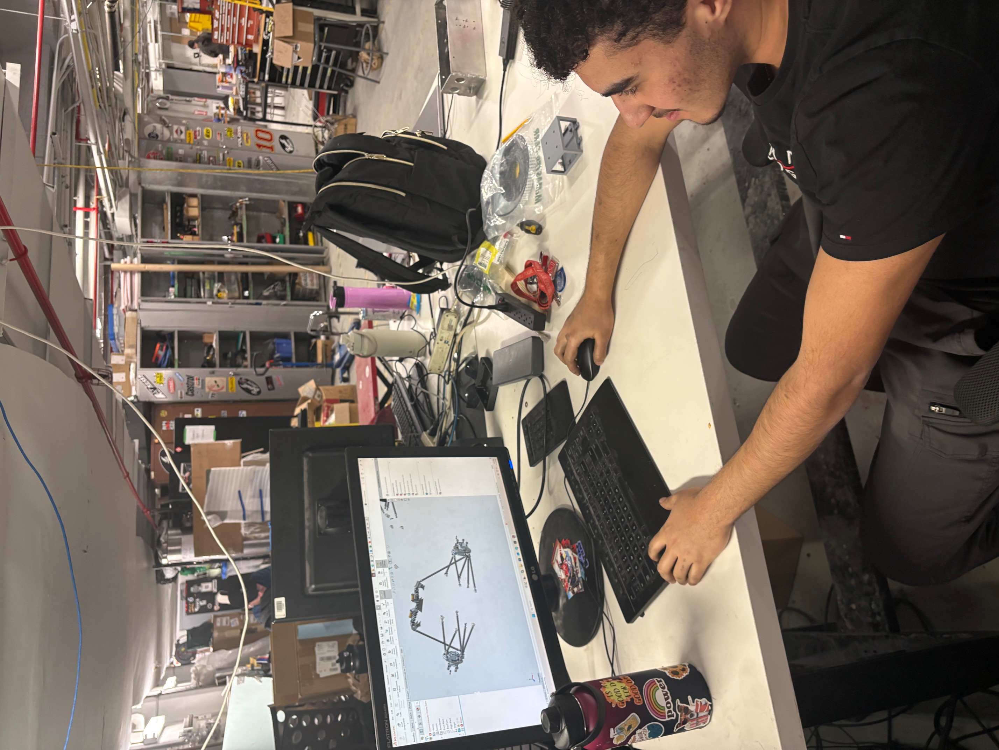
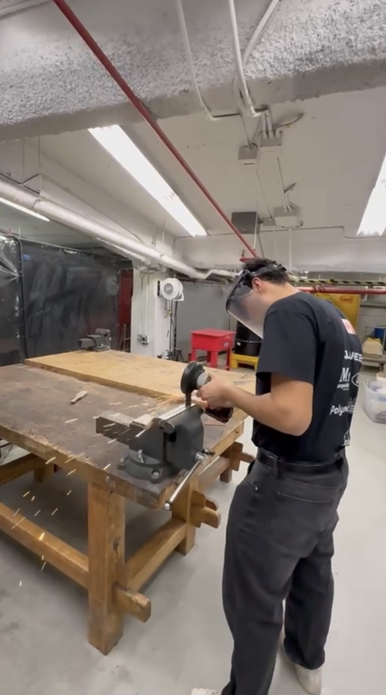
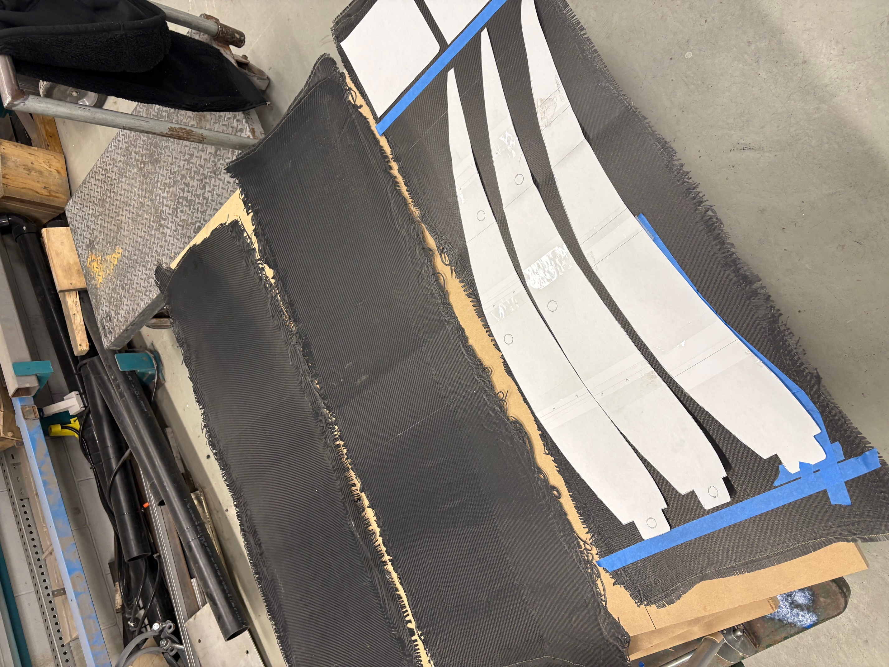
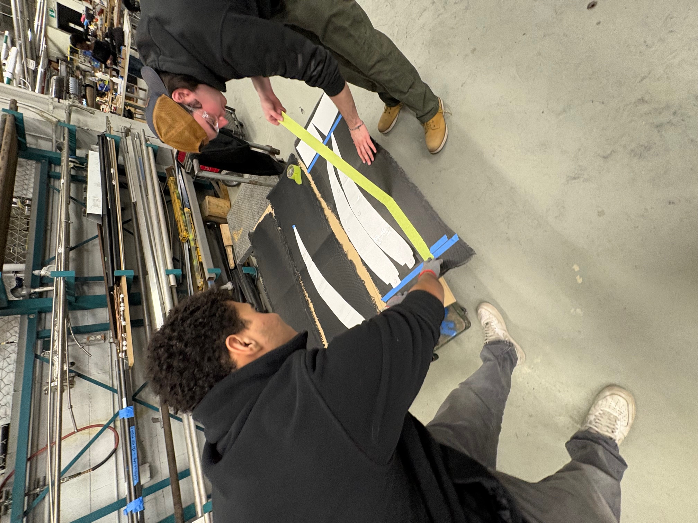
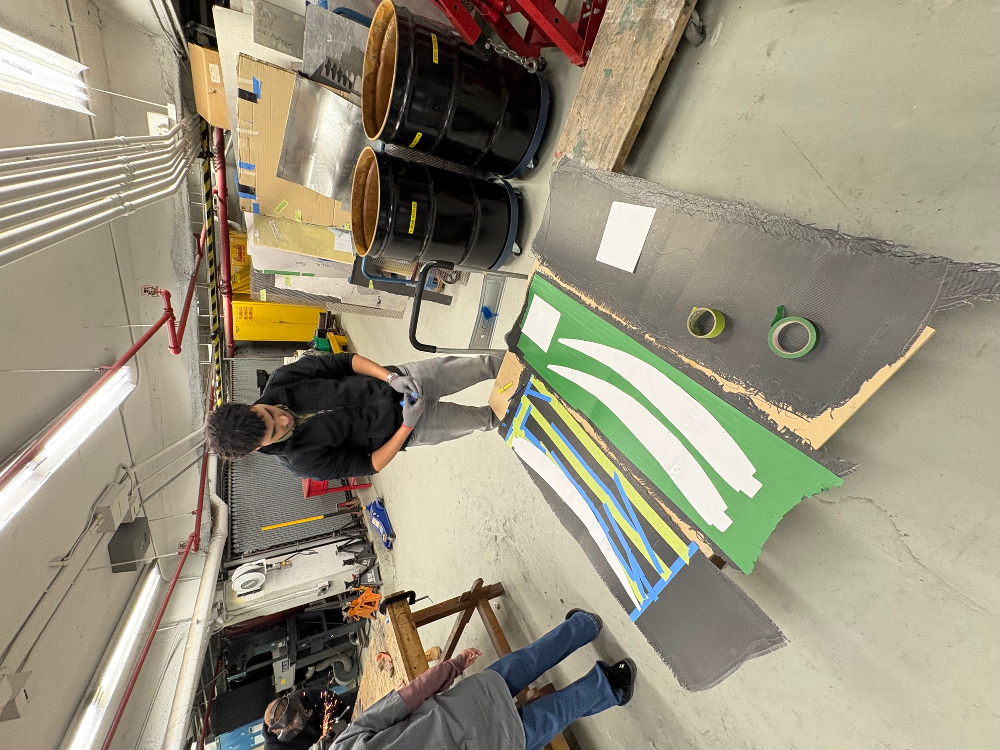
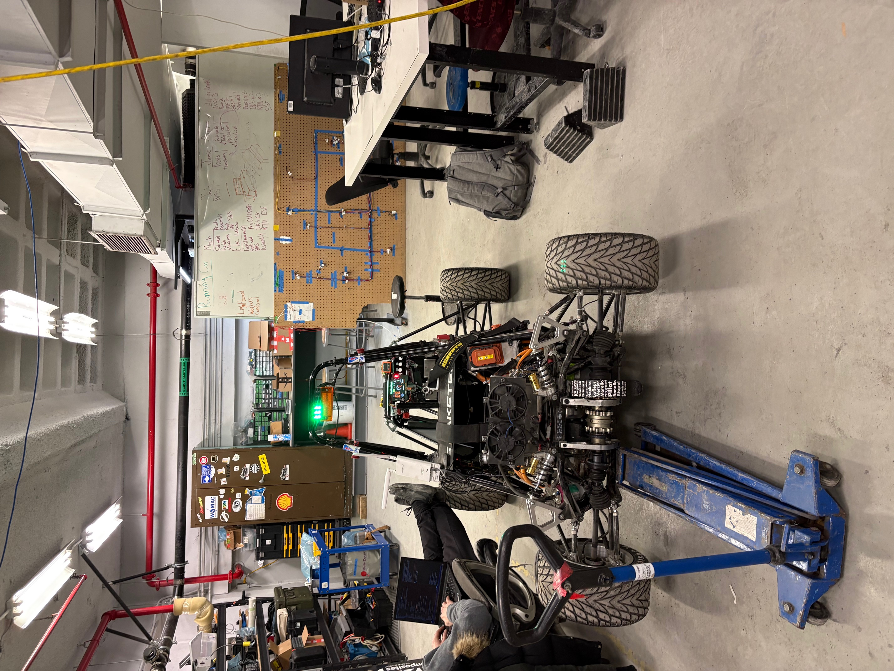
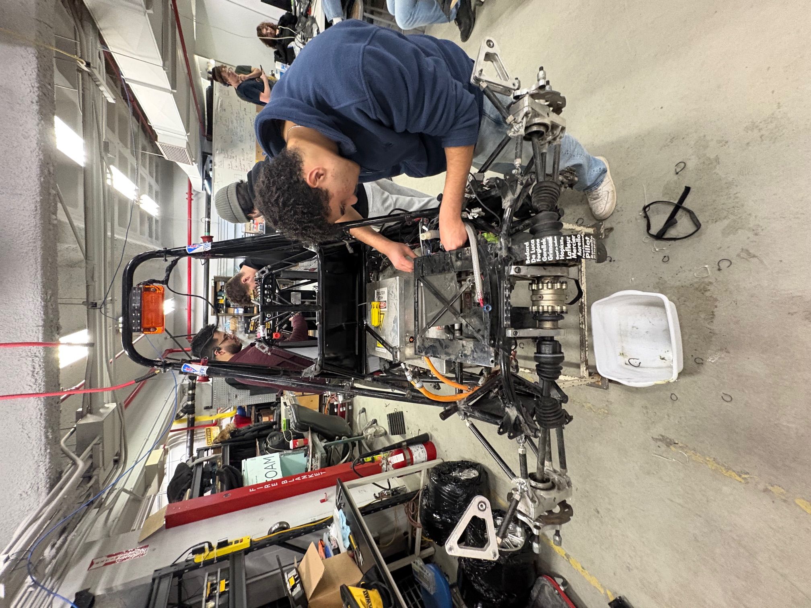
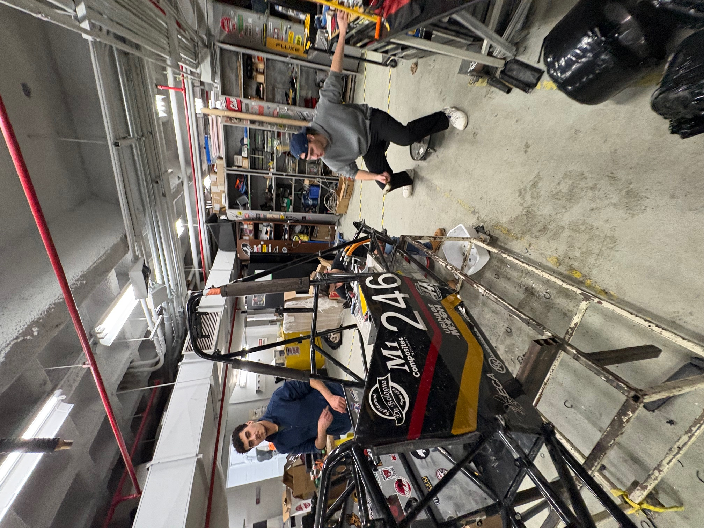

# Formula-SAE – Mechanical Team Experience

## Overview
Participated in the Formula SAE team as part of the mechanical group, contributing to the assembly and integration of a student-designed race car. Gained hands-on experience working in a team-based engineering environment and applying fundamental mechanical concepts to a real system.

## Responsibilities
- Assisted in the mechanical assembly of vehicle components, including chassis, suspension, and drivetrain elements  
- Supported system integration by helping fit and align different subsystems  
- Participated in team discussions related to design and problem-solving  
- Maintained organization of tools and components during build sessions  

## Skills Developed
- Mechanical assembly and hands-on tool usage  
- Understanding of vehicle systems (suspension, drivetrain, chassis)  
- Team collaboration in an engineering environment  
- Attention to detail and precision during assembly  

## What I Learned
- How theoretical concepts from coursework apply to real engineering systems  
- The importance of tolerances, alignment, and proper assembly techniques  
- How large engineering projects are managed through teamwork and communication  

## Images

  
  
  

  
  
  

  
  

  
  

